# Getting started with Keycloak

This step-by-step walk-through will show you how to get your Keycloak server set up to work with
the minimal example. For this tutorial, I am running Keycloak locally with Docker.

You will need:

* Docker installed (or an existing Keycloak server)
* Python 3.8+ installed
* Python packages `armasec` and `uvicorn` installed


## Start your Keycloak server

If you want to try the example locally without an existing Keycloak server, you can start a new one
using Docker with the following command:

```bash
docker run -p 8080:8080 -e KEYCLOAK_ADMIN="admin" -e KEYCLOAK_ADMIN_PASSWORD="admin" keycloak/keycloak:18.0.0 start-dev
```

This will start a server who's admin UI is available at localhost:8080.


Open a browser and load the address `localhost:8080`. Then, click on the "Administration Console" to
log in.

{: .framed-image}
_Log-in to admin console_

The sign-in credentials for the admin account are:

| _Field_  | _Value_ |
| -------- | ------- |
| Username | admin   |
| Password | admin   |

After you log in, you will load the "Master" realm.


## Set up your "Master" realm

First, we need to change the lifespan for tokens. By default they expire after 1 minute, but that's
not so friendly for a tutorial, so we will lengthen the lifespan to 5 minutes.

Go to the "Tokens" tab of your "Master" realm and set the "Access Token Lifespan" to 5 minutes.

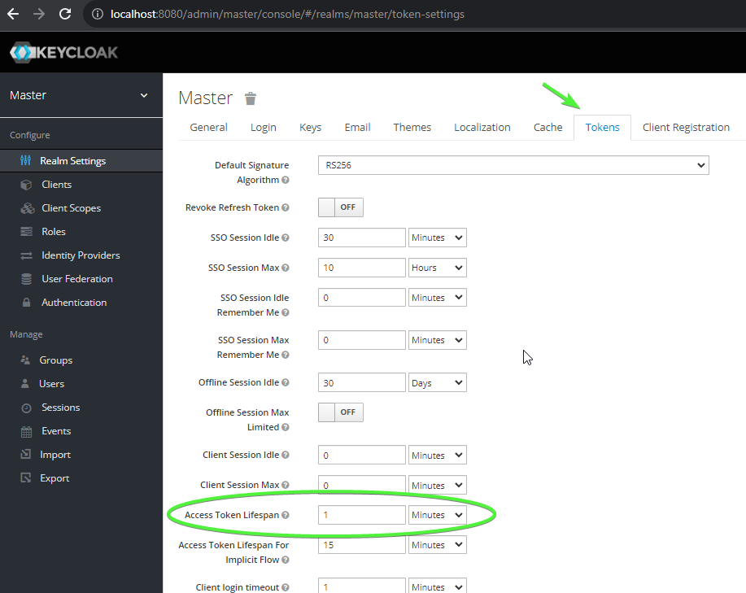{: .framed-image}
_Ream settings_

Click "Save" at the bottom after you change the value. All of the rest of the settings can be left as they are.


## Set up a client

We will need a client that is configured with our permissions. To do this, navigate to the "Clients"
tab in the nav bar and click the "Create" button:

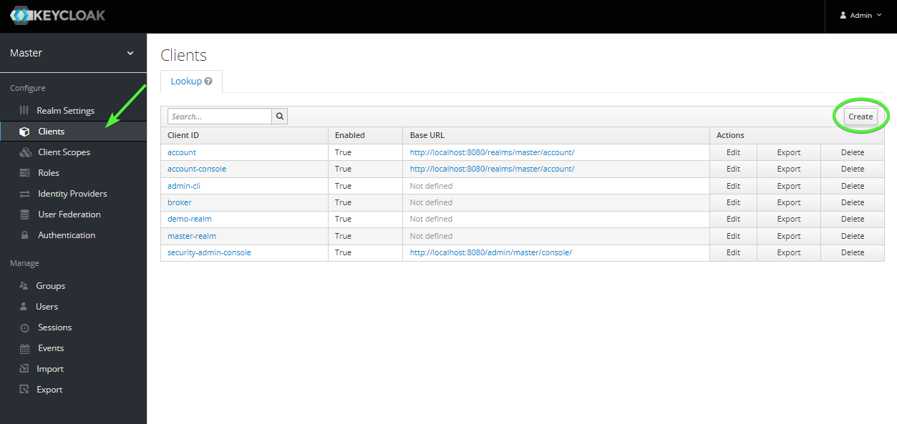{: .framed-image}
_Clients_

For this tutorial, we will use the name "armasec_tutorial". Click "Save" to create the new client.

[TODO]: # (Take new screenshots with "armasec_tutorial" instead of "armasec-tutorial")

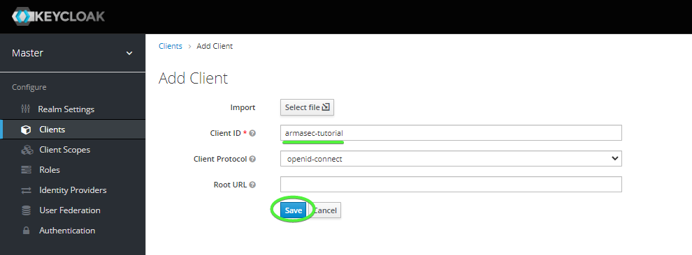{: .framed-image}
_Create client_

Now we need to set the following values for the new client:

| _Field_                  | _Value_      |
| ------------------------ | ------------ |
| Access Type              | Confidential |
| Service Accounts Enabled | ON           |
| Valid Redirect URIs      | *            |

The service account produce a token using the client secret over an API request to Keycloak.

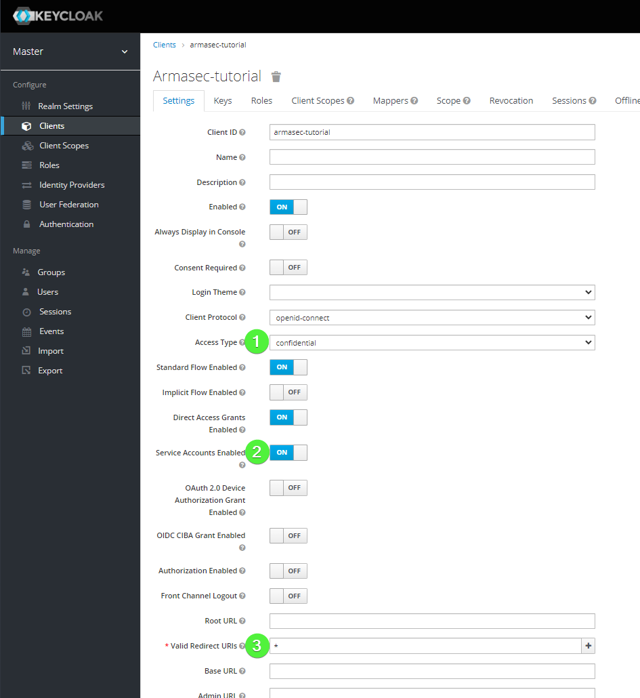{: .framed-image}
_Client settings_

Next, we need to save the "Client Secret" for later when we request a token. Navigate to the
"Credentials" tab and copy the value found in the "Secret" field.

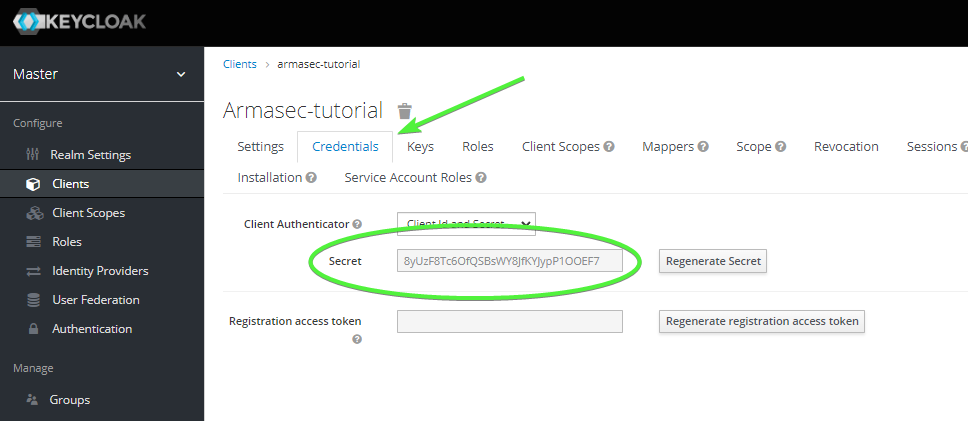{: .framed-image}
_Secrets_

Next, we need to create the "Roles" that Armasec uses for the "permissions" claim inside the tokens.
Navigate to the "Roles" tab for the client and click the "Add Role" button.

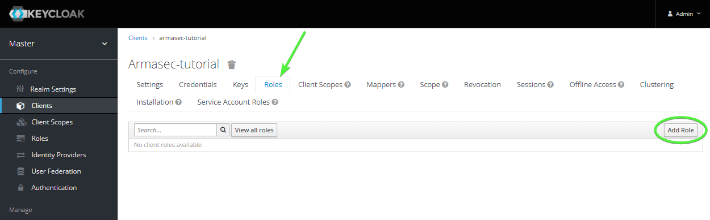{: .framed-image}
_Add role_

Fill the "Role Name" field with "read:stuff". There's no need to add a description at this time.
Click the "Save" button to add the role to the client.

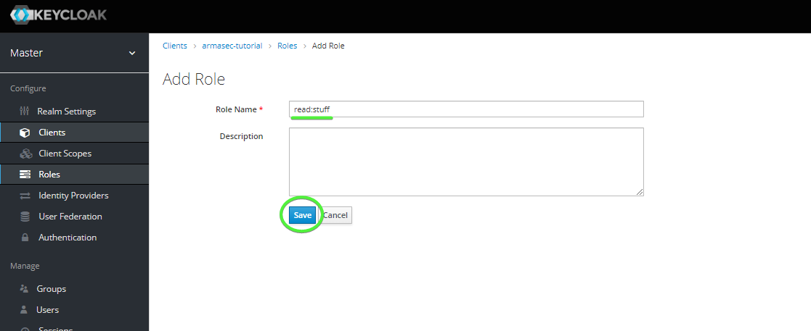{: .framed-image}
_Save role_


CHANGE ME!!!!!!!!!!!!!!!!!!!!!!!!!!!!!!!!!!!
Next, we need to set up a Mapper that will put the roles inside of the "permissions" claim in the
issued tokens. Navigate back to the "armasec_tutorial" client and open the "Mappers" tab. Click the
"Create" button to add a new mapper.

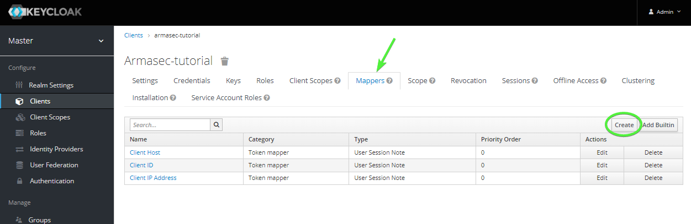{: .framed-image}
_Mappers_

In the form, there's a few things to set:

| _Field_          | _Value_          |
| -----------------| ---------------- |
| Name             | permissions      |
| Mapper Type      | User Client Role |
| Client ID        | armasec_tutorial |
| Token Claim Name | Permissions      |
| Claim JSON Type  | String           |

Set the fields as specified above and click the "Save" button to create the new mapper

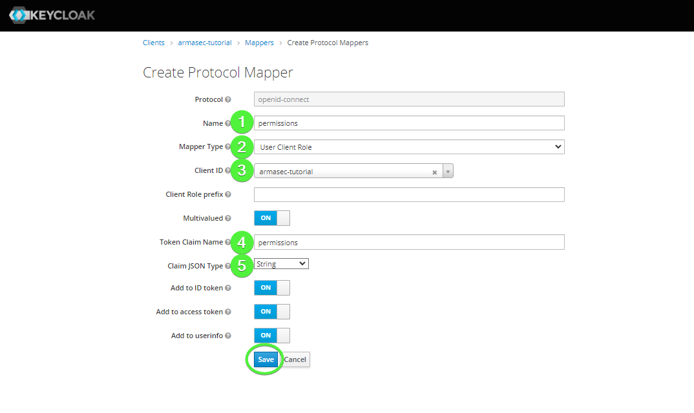{: .framed-image}
_Permissions mapper_
CHANGE ME!!!!!!!!!!!!!!!!!!!!!!!!!!!!!!!!!!!

Finally, we need to set up an "Audience" mapper to set the audience claim in the token that our
example app will check for.

Create a new mapper with the following settings:

| _Field_                  | _Value_               |
| ------------------------ | --------------------- |
| Name                     | audience              |
| Mapper Type              | Audience              |
| Included Custom Audience | http://keycloak.local |
| Add to ID token          | ON                    |

Click "Save" to create the new mapper.

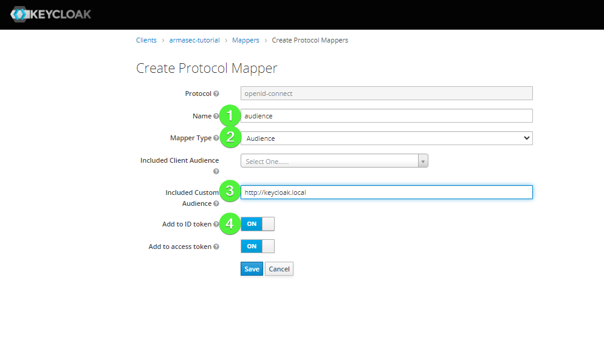{: .framed-image}
_Audience mapper_

Now, for the purposes of this tutorial, we will be getting a token via a request with a
"Service Account Role". We need to add the role we created above to the "Service Account Role" so
that the token issued later includes the needed permissions.

Navigate to the "Service Account Roles" tab. Then, select "armasec_tutorial" for the "Client Roles"
field. Select the "read:stuff" role and add it with the "Add selected >>" button.

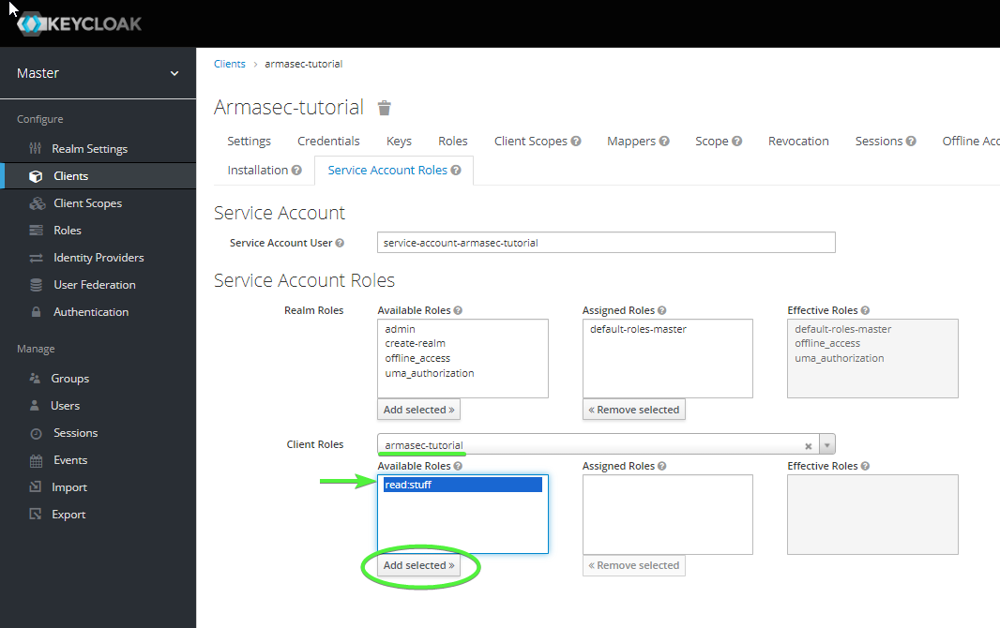{: .framed-image}
_Add role_

Now your client should be all set up and ready to go.


## Start up the example app

```python title="example.py" linenums="1"
from armasec import Armasec
from fastapi import FastAPI, Depends


app = FastAPI()
armasec = Armasec(
    domain="localhost:8080/realms/master",
    audience="http://keycloak.local",
    use_https=False,
    payload_claim_mapping=dict(permissions="""resource_access."armasec_tutorial".roles"""),
    debug_logger=print,
    debug_exceptions=True,
)

@app.get("/stuff", dependencies=[Depends(armasec.lockdown("read:stuff"))])
async def check_access():
    return dict(message="Successfully authenticated!")
```

Note in this example that the `use_https` flag must be set to false to allow a local server using
unsecured HTTP.

Copy the `example.py` app to a local source file called "example.py".

Start it up with uvicorn (running in the background):

```bash
python -m uvicorn --host 0.0.0.0 example:app
```

Once it is up and running, hit `<ctrl-z>` and type the command `bg` to put the uvicorn
process into the background. You should make sure to kill the process when you complete
the tutorial.


## Get the test token

We will use `curl` to get an example token to test out our route's security. You will
need to replace `$CLIENT_SECRET` with the secret variable we noted earlier.
Alternatively, you can set a shell variable with this value and use the command
directly.


```bash
curl -d "client_id=armasec_tutorial&client_secret=$CLIENT_SECRET&grant_type=client_credentials" -X POST "http://localhost:8080/realms/master/protocol/openid-connect/token"
```

You should see a JSON blob printed out that includes an `access_token` attribute along
with other metadata about the token.


## Try it out

Open a browser to [localhost:8000/docs](http://localhost:8000/docs){:target="_blank"}


{: .framed-image}
_Swagger_

This will show you the auto-generated swagger docs for the example API app. Click on the
`Authorize` button to add the token you copied to the clipboard in the header of requests to the
API.


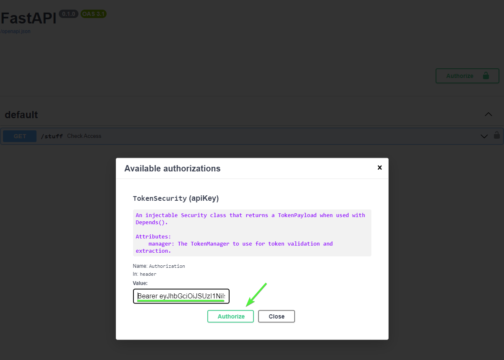{: .framed-image}
_Authorize_

First, type "Bearer " followed by pasting the token from the clipboard into the form and click the
`Authorize` button in the dialog, click `Close` to dismiss the dialog. Now, all subsequent calls
to the API will include a header that looks like:

```json
{
  "Authorization": "Bearer eyJhbGciOi..."
}
```


Now, expand the "GET" REST operation on the `/stuff` endpoint and click `Try it out`.

{: .framed-image}
_Try it out_


Finally, click `Execute` to issue the request to the API.

{: .framed-image}
_Execute_


You should see a response that includes a 200 status code and a response body that includes:

```json
{
  "message": "Successfully authenticated"
}
```

Congratulations! You are now using Armasec and Auth0 to authorize requests to your API.


## Tinker

Now, there are a few things you can do to check out how things work. Try the following things:

* Remove the "read:stuff" role from the Service Account and try another request
* Try a request without being authorized in swagger
* Try making requests using `curl` or the `httpx` library in IPython


## Send feedback

If the above tutorial didn't work as expected, a step needs better clarification, or you have some
questions about it, please create an issue on
[Armasec's GitHub's issues](https://github.com/omnivector-solutions/armasec/issues>).
