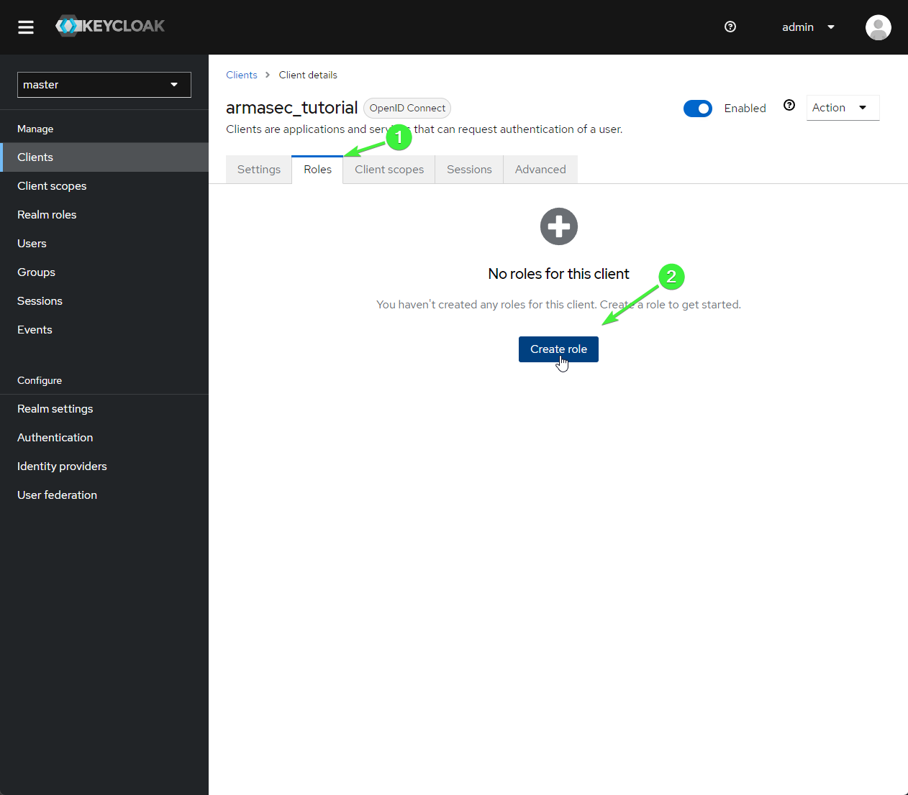
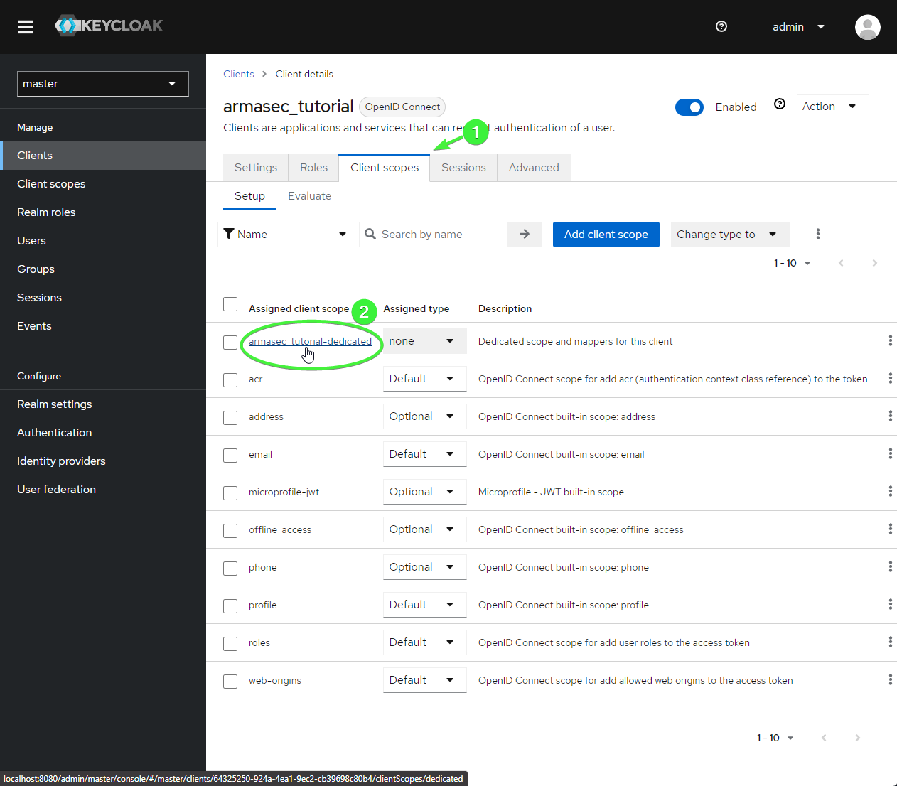
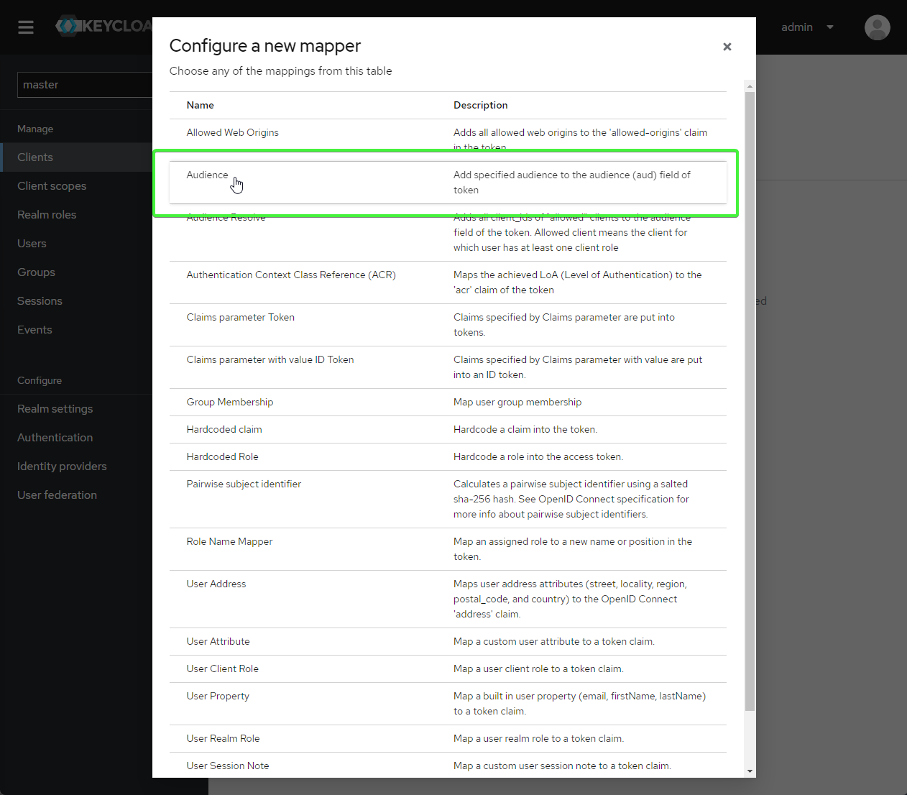

# Getting started with Keycloak

This step-by-step walk-through will show you how to get your Keycloak server set up to work with
the minimal example. For this tutorial, I am running Keycloak locally with Docker.

You will need:

* Docker installed (or an existing Keycloak server)
* Python 3.8+ installed


## Installing python packages

The first thing you will need to do is to install some neeeded python dependencies. In
order to run the example API, you will need the the `uvicorn` package installed. You
will also be using the Armasec CLI to verify that you can log in. For this, you will
need the `armasec` package with the `cli` extra. For this tutorial, it will be best to
work in a new virtual environment. To bootstrap it, run the following commands:

```bash
python -m venv env
source env/bin/activate
pip install uvicorn armasec[cli]
```

When the commands finish running, your environment will be ready to complete this guide.


## Start your Keycloak server

If you want to try the example locally without an existing Keycloak server, you will
need to start a new one. Docker is the easiest way to get Keycloak up and running. To
start the Keycloak server in Docker, run the following command:

```bash
docker run -p 8080:8080 -e KEYCLOAK_ADMIN="admin" -e KEYCLOAK_ADMIN_PASSWORD="admin" keycloak/keycloak:22.0.5 start-dev
```

This will start a new Keycloak server with an admin UI available at localhost:8080.
A new `admin` user will automatically be created with the password "admin".


Open a browser and load the address `localhost:8080`. Then, click on the "Administration
Console" to log in.

{: .framed-image}
_Log-in to admin console_

The sign-in credentials for the admin account are:

| _Field_  | _Value_ |
| -------- | ------- |
| Username | admin   |
| Password | admin   |

After you log in, the UI will automatically load the "Master" realm.


## Set up your "Master" realm

First, you should change the lifespan for tokens. By default they expire after 1 minute,
but that's not so friendly for a tutorial, so you should lengthen the lifespan to 15
minutes.

Click on the "Realm settings" section in the side-nav, and then go to the "Tokens" tab.
Find the "Access Token Lifespan" setting, and change it to 15 minutes.

{: .framed-image}
_Realm settings_

Click "Save" at the bottom after you change the value. All of the rest of the settings
can be left as they are.


## Set up a client

You will need a client that is configured for the tutorial. To do this, navigate to
the "Clients" tab in the nav bar and click the "Create client" button in the
"Clients list" tab:

{: .framed-image}
_Create the client_

A creation wizard will load starting with the "General Settings" tab. For this tutorial,
use the name "armasec_tutorial". Click the "Next" button to go on to the next page.

{: .framed-image}
_Name the client_


In the "Capability config" page, select the
"OAuth 2.0 Device Authorization Grant" setting. This will be needed to log in via the
Armasec CLI later. Click the "Next" button to go on to the next page.

{: .framed-image}
_Device auth_

Finally, in the "Login settings" page, put "\*" in the "Valid redirect URIs" setting.
Click the "Save" button to finish creating the new client.

{: .framed-image}
_Redirect URIs_

Once the new client is created, you will be redirected to the "Client details" page.

This tutorial demonstrates how to set up role-based access on an API endpoint. So, the
next step is to create a role that the API will require users to have in order to access
an endpoint.

Click on the "Roles" tab of the "Client Details" page, and then click the "Create role"
button.

{: .framed-image}
_Create Role_

The name is not important as long as it matches on your API endpoint. For this tutorial,
name the role "read:stuff" and then click the "Save" button.

{: .framed-image}
_Name Role_


The final step for our new client is to set up an "Audience" mapper to set the audience
claim in the token that our example app will check for.

Navigate back to the "Client details" for our "armasec_tutorial" client and open the
"Client scopes" tab. To add a new mapper for our client, click the link for
"armasec_tutorial-dedicated" scope.

{: .framed-image}
_Client Scopes_

The "Mappers" tab will load by default. Click the "Configure a new mapper" button.

{: .framed-image}
_Configure Mapper_

Select the "Audience" mapper from the list that is shown.

{: .framed-image}
_Select Audience_

The "Add mapper" form will be loaded next. In this form, name the mapper "Audience" and
set the "Included Custom Audience" field to "http://keycloak.local". Make sure
"Add to ID token" is selected. Finally, click "Save" to finish adding the new mapper.

{: .framed-image}
_Mapper Settings_

The last step in configuring keycloak is setting up a user that will be accessing the
protected endpoint.

Navigate to the "Users" section using the side-nav and click the "Add user" button to
get started.

{: .framed-image}
_Add User_

In the "Create user" form that is opened next, name your user "local-user" and provide
a fake email address like "local-user@keycloak.local". Click "Create" to create the new
user.

{: .framed-image}
_Create User_

Next, we need to assign the user a password that they will use to log in. Open the
"Credentials" tab in the "User details" page for your new user. Click the "Set password"
button.

{: .framed-image}
_Set Password_

In the form that opens, use "local" for the password (and confirmation). Make sure to
turn off the "Temporary" flag so that the user will not have to change their password
in this tutoria. Then, click the "Save" button to finish setting up the user
credentials.

{: .framed-image}
_Save Password_

Next, we need to add the "read:stuff" role that we created before to your new user. Open
the "Role mapping" tab in the "User details" page for your new user. Click the
"Assign role" button.

{: .framed-image}
_Assign Role_

In the "Assign roles to local-user" dialog that opens, click the drop down that shows
"Filter by realm roles" and switch the setting to "Filter by clients". Find the
"read:stuff" role that was assigned to the "armasec_tutorial" client, select it, and
click the "Assign" button to assign this role to your new user.

{: .framed-image}
_Select Role_

Now your client should be all set up and ready to go! **Make sure you log out of the
admin portal before you go on** so that you are ready to log in with your new user later
on in the tutorial. Otherwise, you will automatically be logged in as the admin user,
and this user does not have any roles mapped to it!


## Start up the example app

```python title="example.py" linenums="1"
from armasec import Armasec
from fastapi import FastAPI, Depends


app = FastAPI()
armasec = Armasec(
    domain="localhost:8080/realms/master",
    audience="http://keycloak.local",
    use_https=False,
    payload_claim_mapping=dict(permissions="resource_access.armasec_tutorial.roles"),
    debug_logger=print,
    debug_exceptions=True,
)

@app.get("/stuff", dependencies=[Depends(armasec.lockdown("read:stuff"))])
async def check_access():
    return dict(message="Successfully authenticated!")
```

Note in this example that the `use_https` flag must be set to false to allow a local
server using unsecured HTTP.

Also not that we need to add a `payload_claim_mapping` because Keycloak does not provide
a permissions claim at the top level. This mapping copies the roles found at
`resource_access.armasec_tutorial.roles` to a top-level attribute of the token payload
called permissions.

Copy the `example.py` app to a local source file called "example.py".

Start it up with uvicorn:

```bash
python -m uvicorn --host 0.0.0.0 --port 8000 example:app
```

Once it is up and running, hit `<ctrl-z>` and type the command `bg` to put the uvicorn
process into the background. You should make sure to kill the process when you complete
the tutorial.


## Login via Armasec CLI

Next, you will log in using the Armasec CLI to get an API token to access your example
API. Before you log in, however, you will need to configure the Armasec CLI to connect
to your Keycloak server. Type the following command to configure the CLI:

```bash
armasec set-config --domain=localhost:8080/realms/master --audience=http://keycloak.local --no-use-https --client-id=armasec_tutorial
```

Now you should be ready to log in. In your terminal, type the following command to start
the process:

```bash
armasec login
```

The CLI will show a box prompting you to complete the login process in a browser:

```
╭─────────────────────────────────────────── Waiting for login ───────────────────────────────────────────╮
│                                                                                                         │
│   To complete login, please open the following link in a browser:                                       │
│                                                                                                         │
│     http://localhost:8080/realms/master/device?user_code=TQOL-RIYP                                      │
│                                                                                                         │
│   Waiting up to 6.0 minutes for you to complete the process...                                          │
│                                                                                                         │
╰─────────────────────────────────────────────────────────────────────────────────────────────────────────╯

Waiting for web login... ╸━━━━━━━━━━━━━━━━━━━━━━━━━━━━━━━━━━━━━━━   2% 0:04:56
```

Open the provided link in the browser and log in using the "local-user" that you
created.

{: .framed-image}
_Log in_

You will then be prompted with a question asking if you want to grant access. Click
"Yes" to complete the log in process. The browser will show a message confirming that
you are now logged in. You may close that browser tab.

Notice in the terminal, a message is now printed showing that your user was logged in:

```bash
╭────────────────────────────────────────────── Logged in! ───────────────────────────────────────────────╮
│                                                                                                         │
│   User was logged in with email 'local-user@keycloak.local'                                             │
│                                                                                                         │
╰─────────────────────────────────────────────────────────────────────────────────────────────────────────╯
```

## Fetch the auth token

Next, you will use the Armasec CLI to fetch the token for the logged in user. To do
this, you will use the `show-token` subcommand. In a terminal, type (the prefix flag
includes the "Bearer" type indicator for the token):

```bash
armasec show-token --prefix
```

The Armasec CLI will print out a box showing the auth token for your user:

```bash
╭───────────────────────────────────────────── Access Token ──────────────────────────────────────────────╮
│                                                                                                         │
│ Bearer                                                                                                  │
│ eyJhbGciOiJSUzI1NiIsInR5cCIgOiAiSldUIiwia2lkIiA6ICJ3dzlNZ0FSNExXbXNuTE9vYTJKTkE4WXZkVUFZX25jZnNvcTU0c3d │
│ kbERzIn0.eyJleHAiOjE3MDA1OTE2OTAsImlhdCI6MTcwMDU5MTYzMCwiYXV0aF90aW1lIjoxNzAwNTkxNjI4LCJqdGkiOiI0ZTNmN2 │
│ U4Ni00ZTJhLTQwZDAtOWQ3ZS0zZTRmYjNkMzk1YWYiLCJpc3MiOiJodHRwOi8vbG9jYWxob3N0OjgwODAvcmVhbG1zL21hc3RlciIsI │
│ mF1ZCI6WyJodHRwOi8va2V5Y2xvYWsubG9jYWwiLCJhY2NvdW50Il0sInN1YiI6IjMxMzY1ZWYyLTZmYjYtNGVhOS04MmE2LWUwMTli │
│ YjYwNmFkOSIsInR5cCI6IkJlYXJlciIsImF6cCI6ImFybWFzZWNfdHV0b3JpYWwiLCJzZXNzaW9uX3N0YXRlIjoiYTc2ZWEzYTEtZGE │
│ 3MC00Mzg2LWFiZTMtZjFjZjYzZDI5ZjZhIiwiYWNyIjoiMSIsInJlYWxtX2FjY2VzcyI6eyJyb2xlcyI6WyJkZWZhdWx0LXJvbGVzLW │
│ 1hc3RlciIsIm9mZmxpbmVfYWNjZXNzIiwidW1hX2F1dGhvcml6YXRpb24iXX0sInJlc291cmNlX2FjY2VzcyI6eyJhcm1hc2VjX3R1d │
│ G9yaWFsIjp7InJvbGVzIjpbInJlYWQ6c3R1ZmYiXX0sImFjY291bnQiOnsicm9sZXMiOlsibWFuYWdlLWFjY291bnQiLCJtYW5hZ2Ut │
│ YWNjb3VudC1saW5rcyIsInZpZXctcHJvZmlsZSJdfX0sInNjb3BlIjoicHJvZmlsZSBlbWFpbCIsInNpZCI6ImE3NmVhM2ExLWRhNzA │
│ tNDM4Ni1hYmUzLWYxY2Y2M2QyOWY2YSIsImVtYWlsX3ZlcmlmaWVkIjpmYWxzZSwicHJlZmVycmVkX3VzZXJuYW1lIjoibG9jYWwtdX │
│ NlciIsImVtYWlsIjoibG9jYWwtdXNlckBrZXljbG9hay5sb2NhbCJ9.ntEA67CNS2ZvPIMac3X-1wKBTiKFS5i5aYo32M7ytVIrnh_X │
│ j_YHLz17WmP3PBKyJtZKgIN8zq_nOF4XeRBMMHSg8ec9ySRNNRia0AkB0AKB-yPa4Q2qGwAFFipWhkP_iQapHj3XWPNDSVRPy8ZvRzb │
│ LDjcgxhvSQE2Yzm68dtiVrcxA-FpImtJRNwARgeXFcvsYjrWfaACLVrvABgi0PiBiqPoFE4-zHEwhVZ3-DfmvXGRj4NxVsOzTyVkzi0 │
│ pfMgHtOzI3MHb_hQ2xAtNBp-Ra5yYXHV3hteb_RPfjVTYADl6fq5Rggi3ydPsJVs0I7GAwzh85P8wRs127dtYv1w                │
│                                                                                                         │
╰──────────────────────────────── The output was copied to your clipboard ────────────────────────────────╯
```

If your terminal supports it, the token will be automatically copied into your clipboard.
However, if you need to manually copy it, you can run the above command again with the
`--plain` flag to print the token without formatting:

```bash
Bearer eyJhbGciOiJSUzI1NiIsInR5cCIgOiAiSldUIiwia2lkIiA6ICJ3dzlNZ0FSNExXbXNuTE9vYTJKTkE4WXZkVUFZX25jZnNvcTU0c3dkbERzIn0.eyJleHAiOjE3MDA1OTE2OTAsImlhdCI6MTcwMDU5MTYzMCwiYXV0aF90aW1lIjoxNzAwNTkxNjI4LCJqdGkiOiI0ZTNmN2U4Ni00ZTJhLTQwZDAtOWQ3ZS0zZTRmYjNkMzk1YWYiLCJpc3MiOiJodHRwOi8vbG9jYWxob3N0OjgwODAvcmVhbG1zL21hc3RlciIsImF1ZCI6WyJodHRwOi8va2V5Y2xvYWsubG9jYWwiLCJhY2NvdW50Il0sInN1YiI6IjMxMzY1ZWYyLTZmYjYtNGVhOS04MmE2LWUwMTliYjYwNmFkOSIsInR5cCI6IkJlYXJlciIsImF6cCI6ImFybWFzZWNfdHV0b3JpYWwiLCJzZXNzaW9uX3N0YXRlIjoiYTc2ZWEzYTEtZGE3MC00Mzg2LWFiZTMtZjFjZjYzZDI5ZjZhIiwiYWNyIjoiMSIsInJlYWxtX2FjY2VzcyI6eyJyb2xlcyI6WyJkZWZhdWx0LXJvbGVzLW1hc3RlciIsIm9mZmxpbmVfYWNjZXNzIiwidW1hX2F1dGhvcml6YXRpb24iXX0sInJlc291cmNlX2FjY2VzcyI6eyJhcm1hc2VjX3R1dG9yaWFsIjp7InJvbGVzIjpbInJlYWQ6c3R1ZmYiXX0sImFjY291bnQiOnsicm9sZXMiOlsibWFuYWdlLWFjY291bnQiLCJtYW5hZ2UtYWNjb3VudC1saW5rcyIsInZpZXctcHJvZmlsZSJdfX0sInNjb3BlIjoicHJvZmlsZSBlbWFpbCIsInNpZCI6ImE3NmVhM2ExLWRhNzAtNDM4Ni1hYmUzLWYxY2Y2M2QyOWY2YSIsImVtYWlsX3ZlcmlmaWVkIjpmYWxzZSwicHJlZmVycmVkX3VzZXJuYW1lIjoibG9jYWwtdXNlciIsImVtYWlsIjoibG9jYWwtdXNlckBrZXljbG9hay5sb2NhbCJ9.ntEA67CNS2ZvPIMac3X-1wKBTiKFS5i5aYo32M7ytVIrnh_Xj_YHLz17WmP3PBKyJtZKgIN8zq_nOF4XeRBMMHSg8ec9ySRNNRia0AkB0AKB-yPa4Q2qGwAFFipWhkP_iQapHj3XWPNDSVRPy8ZvRzbLDjcgxhvSQE2Yzm68dtiVrcxA-FpImtJRNwARgeXFcvsYjrWfaACLVrvABgi0PiBiqPoFE4-zHEwhVZ3-DfmvXGRj4NxVsOzTyVkzi0pfMgHtOzI3MHb_hQ2xAtNBp-Ra5yYXHV3hteb_RPfjVTYADl6fq5Rggi3ydPsJVs0I7GAwzh85P8wRs127dtYv1w
```

Keep the token close at hand; you will be using it shortly to access your API endpoint.


## Try it out

Open a browser to [localhost:8000/docs](http://localhost:8000/docs){:target="_blank"}


{: .framed-image}
_Swagger_

This will show you the auto-generated swagger docs for the example API app. Click on the
`Authorize` button to add the token you copied to the clipboard in the header of requests to the
API.


{: .framed-image}
_Authorize_

First, paste the token (including the "Bearer" prefix) from the clipboard into the form
and click the `Authorize` button in the dialog, click `Close` to dismiss the dialog.
Now, all subsequent calls to the API will include a header that looks like:

```json
{
  "Authorization": "Bearer eyJhbGciOi..."
}
```


Now, expand the "GET" REST operation on the `/stuff` endpoint and click `Try it out`.

{: .framed-image}
_Try it out_


Finally, click `Execute` to issue the request to the API.

{: .framed-image}
_Execute_


You should see a response that includes a 200 status code and a response body that includes:

```json
{
  "message": "Successfully authenticated"
}
```

Congratulations! You are now using Armasec and Keycloak to authorize requests to your API.


## Tinker

Now, there are a few things you can do to check out how things work. Try the following things:

* Remove the "read:stuff" role from your user and try another request
* Try a request without being authorized in swagger
* Try making requests using `curl` or the `httpx` library in IPython


## Send feedback

If the above tutorial didn't work as expected, a step needs better clarification, or you have some
questions about it, please create an issue on
[Armasec's GitHub's issues](https://github.com/omnivector-solutions/armasec/issues>).
