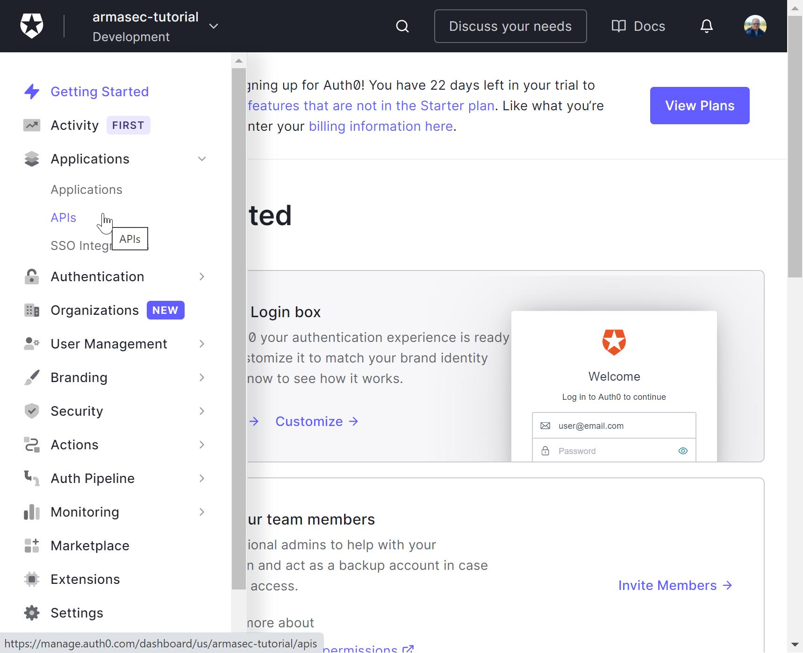
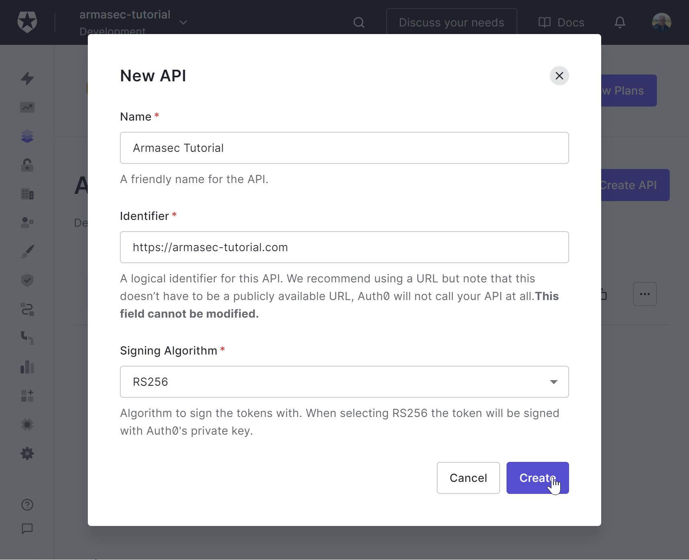
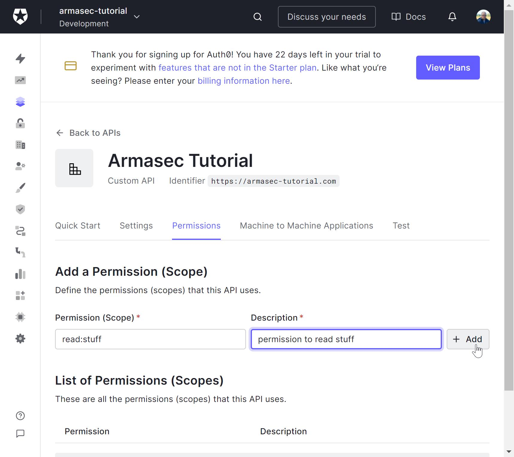
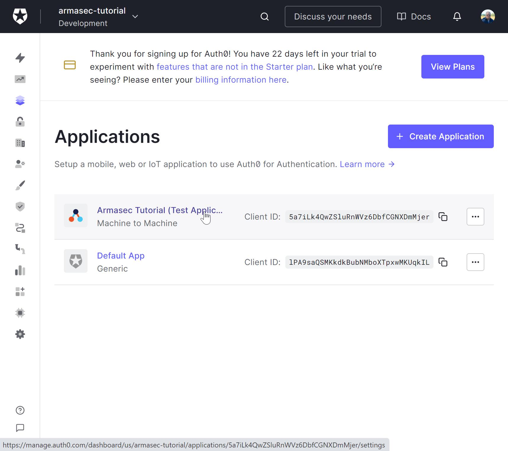
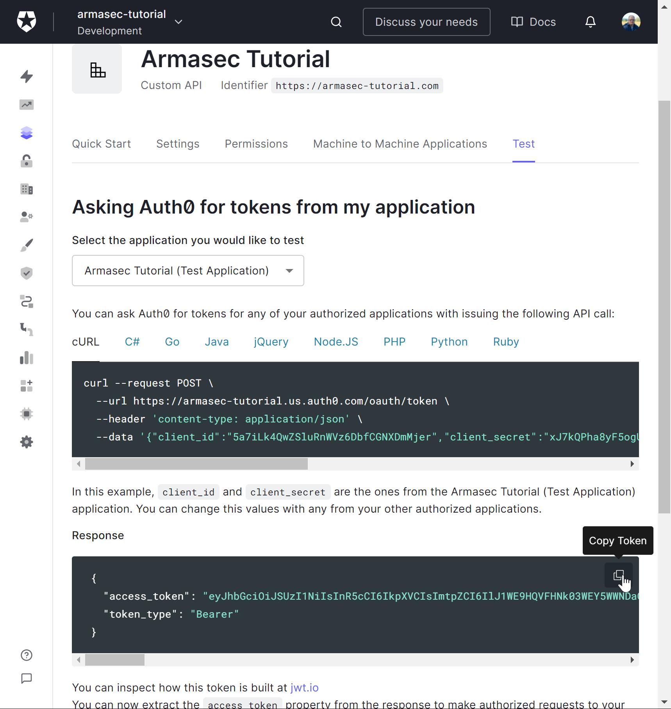
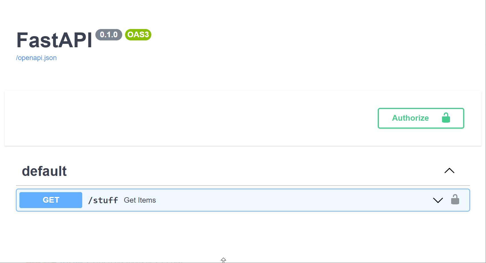
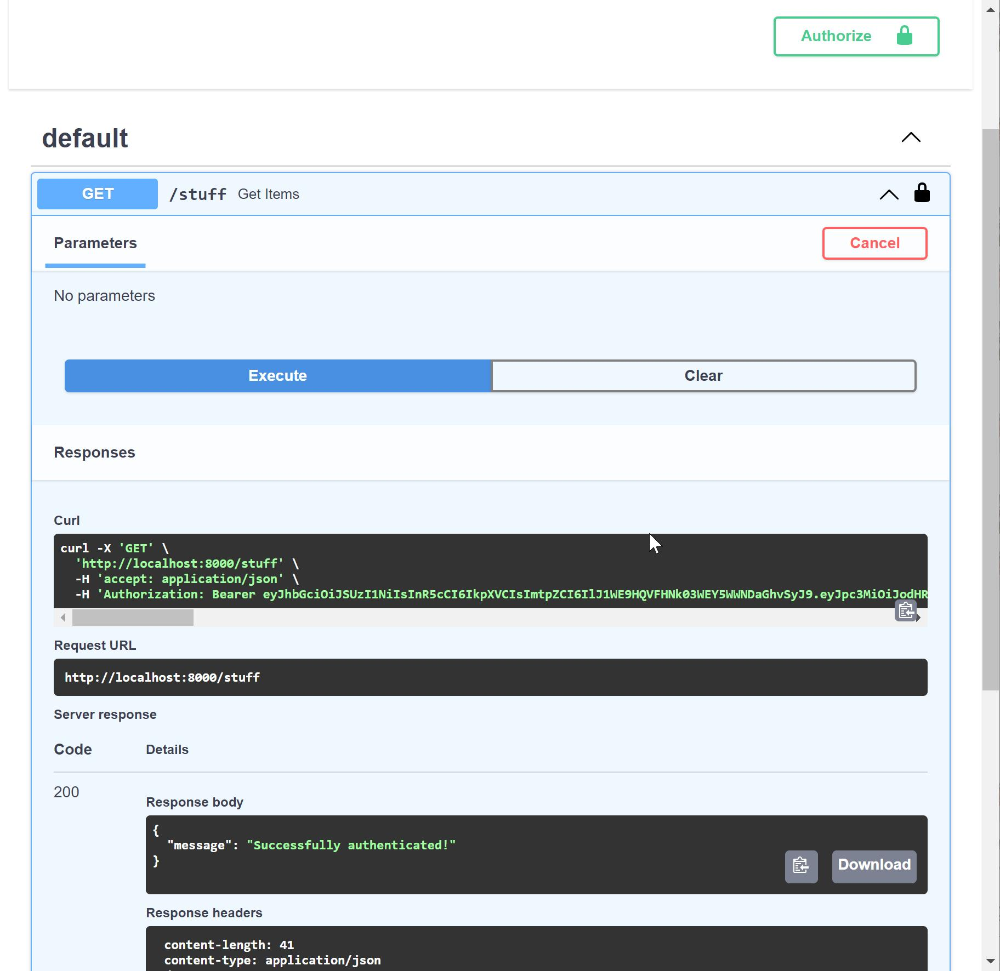

Getting started with Auth0
==========================

This step-by-step walkthrough will show you how to get an Auth0 account set up for use with the
minimal example.

You will need:

* A google account
* Python 3.8+ installed
* Python packages ``armasec`` and ``uvicorn`` installed

Create Auth0 account tenant
---------------------------

Navigate to `Auth0's homepage <https://auth0.com>`_, and click ``Sign Up``.

Create a new account (if you don't already have one). It doesn't really matter how you choose to
sign up, but I used my google account.

.. figure:: ../_static/auth0-1.jpg
   :alt: Create a personal account
   :class: with-border

   Create a personal account

For this tutorial, just select a "Personal" account. You can come back and repeat the process for
your company later if you need to.

Select ``I need advanced settings`` so that you can choose your tenant name, and click ``Next`` to
move on to tenant setup.

.. figure:: ../_static/auth0-2.jpg
   :alt: Select tenant domain
   :class: with-border

   Select tenant domain

Select your tenant domain. For this tutorial, I will be using "armasec-tutorial". Choose your region
and click ``Create Account``. The full domain that I will use later is
"armasec-tutorial.us.auth0.com".

Add your API application
------------------------

This will set up the Auth0 api endpoints that Auth0 will use to authenticate your users.

   Navigate to Applications > APIs

Click ``Applications`` -> ``APIs``

.. figure:: ../_static/auth0-4.jpg
   :alt: Create an API
   :class: with-border

   Create an API

Click ``Create API``

   Fill out API form

Fill out the form. The Name you choose doesn't matter, but for the tutoial, I used
"Armasec Tutorial".  Choose a name for the identifier that makes sense, as this will be the
"Audience" for your tutorial app. I chose "https://armasec-tutorial.com" for this tutorial.

Leave the "Signing Algorithm" as "RS256". Armasec also supports HS256, but it is not preferred.

Click ``Create``

.. figure:: ../_static/auth0-6.jpg
   :alt: Enable RBAC Settings
   :class: with-border

   Enable RBAC Settings

Go to the Settings tab and scroll down to the "RBAC Sttings"

Activate ``Enable RBAC`` and ``Add Permissions`` in the Access Token".

This will include permissions scopes to your users' access tokens.

Click ``Save``

Add your permissions
--------------------

Next, we will add the permission for the minimal example.

   Add a permission

Click on the ``Permissions`` tab and add the "read:stuff" permission.

Grant your permission to the test app
-------------------------------------

Auth0 provides a "Machine-to-Manchine" test app for verifying that log in will work. We will grant
our "read:stuff" permission to tokens provided from this app.

.. figure:: ../_static/auth0-8.jpg
   :alt: Navigate to Applications
   :class: with-border

   Navigate to Applications

Navigate to ``Applications`` -> ``Applications``

   Select tutorial test app

Click on ``Armasec Tutorial (Test Application)``

.. figure:: ../_static/auth0-10.jpg
   :alt: Add permission to test app
   :class: with-border

   Add permission to test app

Go to the APIs tab and click the drop-down. Select the "read-stuff" box in the "Permissions" box.
Click `Update`.

Start up the example app
------------------------

Copy the example app to a local source file called "example.py".

Start it up with uvicorn::

    $ python -m uvicorn --host 0.0.0.0 example:app

Try it out
----------

Next, we will try to use a test token to call our minimal example's endpont.

Navigate back to ``Applications`` -> ``APIs``, select the ``Armasec Tutorial``, and go to the Test
tab.

   Copy test access token

Find the "Response" box. This contains a token that has been issued by your test application. Click
the ``Copy Token`` button.

Now, open a browser to "localhost:8000/docs"

   Swagger page for example

This will show you the auto-generated swagger docs for the example API app. Click on the
``Authorize`` button to add the token you copied to the clipboard in the header of requests to the
API.

.. figure:: ../_static/auth0-13.jpg
   :alt: Add access token in Swagger
   :class: with-border

   Add access token in Swagger

First, type "Bearer " followed by pasting the token from the clipboard into the form and click the
``Authorize`` button in the dialog, click ``Close`` to dismiss the dialog. Now, all subsequent calls
to the API will include a header that looks like:

.. code-block:: json

   {
       "Authorization": "Bearer eyJhbGciOi..."
   }

Now, expand the "GET" REST operation on the ``/stuff`` endpoint and click ``Try it out``.

.. figure:: ../_static/auth0-14.jpg
   :alt: Try it out
   :class: with-border

   Try it out

Finally, click ``Execute`` to issue the request to the API.

   Execute

You should see a response that includes a 200 status code and a response body that includes:

.. code-block:: json

   {
       "message": "Successfully authenticated"
   }

Congratulations! You are now using Armasec and Auth0 to authorize requests to your API.

Tinker
------

Now, there are a few things you can do to check out how things work. Try the following things:

* Remove the "read:stuff" permission from the test application and try another request
* Try a request without being authorized in swagger
* Try making requests using ``curl`` or the ``httpx`` library in IPython

Send feedback
-------------

If the above tutorial didn't work as expected, a step needs better clarification, or you have some
questions about it, please create an issue on
`Armasec's GitHub's issues <https://github.com/omnivector-solutions/armasec/issues>`_.
